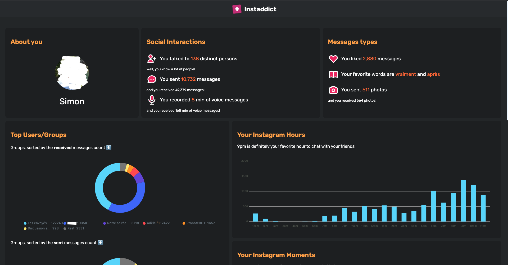

  

# [Instaddict](https://instaddict.androz2091.fr)

How addicted are you to Instagram? Let's give your data package to Instaddict, it will give you the answer.
ㅤㅤㅤㅤㅤㅤㅤㅤ
## Example

### [DEMO](https://instaddict.androz2091.fr/stats/demo)

## How to Use

* Ask for your data file in Instagram (format **must be json**) (`Settings` > `Privacy & Safety`)
* Open **https://instaddict.androz2091.fr**
* and import your data file!

### Docker

This repository provides a Docker image and compose file. Simply run `docker-compose up -d` in the project directory 
and you can access the app at http://localhost:5000.

### Manual Installation

Instaddict is built with **[Svelte](https://svelte.dev)**, and is quite easy to install.

* Clone the repository.
* Install the dependencies using `npm install` or `yarn install`.
* Start the app using `npm run dev` or `yarn dev`!

> Note: for testing purposes, you may append `?demo` to the URL to use the mocked data.